|  |     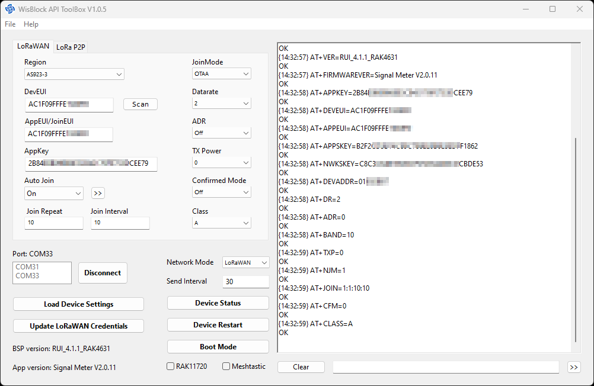 |  |    
| :-: | :-: | :-: |
# WisBlock-API-ToolBox
WisBlock-API-Toolbox is an application for fast setup of WisBlock and WisDuo devices with RUI3 or WisBlock-API-V2 based firmware.     
This tool was written to have a quick access to devices and change settings without the need to use the RAKwireless WisToolBox or a serial terminal and send AT commands manually.    
isBlock-API-Toolbox's functionality is less than what WisToolBox offers (e.g. firmware update is not possible from the tool, no BLE connection) and more than a simple serial terminal (no need to type basic AT commands manually).    

### This tool is

----

## Features
- Connect over USB to WisDuo and WisBlock based devices that are using RUI3 or running an application based on WisBlock-API-V2.
- Get and set device settings for LoRa and LoRaWAN
- Force device into Bootloader mode
- Set device send interval (if supported by AT command)
- Restart device
- Optional with time stamp on the debug output
- Optional with command echo on the debug output

----

## Installation

### Windows 
For Windows, a installer application is available to install the application. => [_**SetupWisBlock-API-ToolBox.exe**_](./SetupWisBlock-API-ToolBox.exe)

### MacOS
A compressed tar file with the application is available for download, it will work in a Sandbox.    
_**⚠️ MacOS version is untested, I don't have any devices with MacOS**_

### Linux
The application and required resources and libray files are available for download.    
_**⚠️ Linux version is untested, I don't have any devices with Linux**_

All files are available in the [RELEASES](https://github.com/beegee-tokyo/WisBlock-API-ToolBox/releases) of this repo.    

----

## Usage

Connect a RAKwireless RUI3 or WisBlock-API-V2 device over USB to the computer.    
Open the application and select the USB port from the _**Available Ports**_ list, then push _**Connect**_

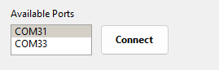

After connection, use the _**Load Device Settings**_ to read the current setup from the device.    
_**📝 Custom AT commands are not always available immediately after a device reboot. Wait for the device to show it's startup message in the log window.**_

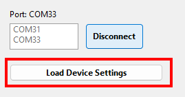

_**⚠️ This works only with a device that supports the RUI3 AT command and with a device that runs an application using the [WisBlock-API-V2](https://github.com/beegee-tokyo/WisBlock-API-V2)**_

Once the device settings are loaded, the upper part of the screen will show either the LoRaWAN settings or the LoRa P2P settings, depending on the current network mode of the device.    

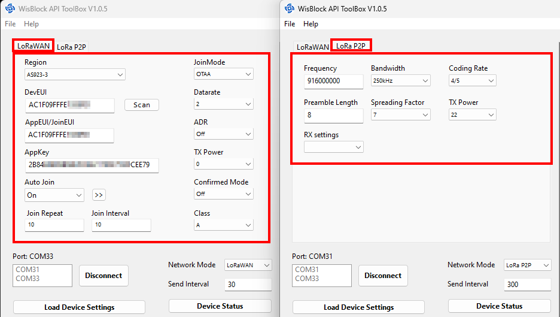

_**📝 It can happen that the device settings acquisition hangs, specially if the device itself is producing a lot of debug output on the Serial/USB port.**_    
_**In this case, the connection to the device will be closed after a timeout. Retry to connect and load the settings again**_

----

## General functions

After the device settings are loaded, additional information and buttons will be available.

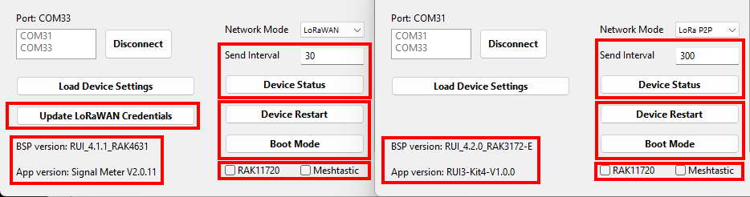

1) **Update LoRaWAN Credentials** (only if device is in LoRaWAN mode)    
Save the DevEUI, AppEUI, AppKey (in OTAA join mode) or Device Address, NwSKey and AppSKey to the device.

2) **Send Interval** (only available if the device has a custom AT command to set the data send interval)     
Set the interval to send data in seconds. After entering the number, use the _**ENTER**_ key to send the new interval to the device

3) **Device Status** (only available if the device has a custom AT command to show the device status information)    
Shows an overview of the devices settings and status in the log output.

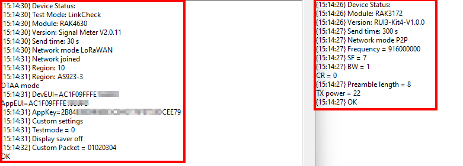

4) **BSP version** and **App version**      
RUI3 based devices show the RUI3 version and device type.    
WisBlock API based devices show the WisBlock-API-V2 version.    
Custom firmware version is only available if the application version is set by the application running on the device.    

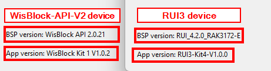

5) **Device Restart**
Forces a reset of the connected device.

6) **Boot Mode**
Forced the device to enter bootloader mode for firmware upload.

7) **RAK11720** check box    
The RAK11720 requires an additional wake-up command after it entered sleep mode. Enabling this button forces to send a wake-up AT command to the RAK11720 before device data is sent.    
_**📝 When Load Device Settings is used and a RAK11720 is detected, the checkbox is automatically set**_

8) **Meshtastic** check box    
Experimental approach to set a device to a LoRa P2P mode that enables it to receive Meshtastic data packets.    
Can only be used to check Meshtastic communication, it cannot decode Meshtastic data packets or send Meshtastic data packets.

----

## Change network mode

The selector _**Network Mode**_ allows to change between LoRa P2P and LoRaWAN mode.

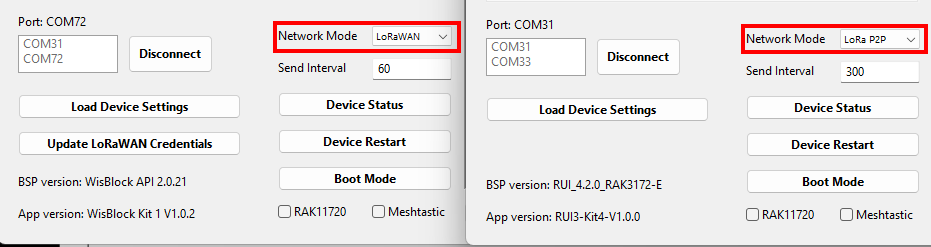

_**⚠️ Changing the device network mode will send immediately a command to the device. Changing the network mode WILL cause a device reboot**_

----

## Change LoRaWAN settings

Depending on the LoRaWAN join mode, the LoRaWAN settings will show either     
- DevEUI, AppEUI/JoinEUI and AppKey    

or     
- Device Address, App Session Key and NW Session Key.    

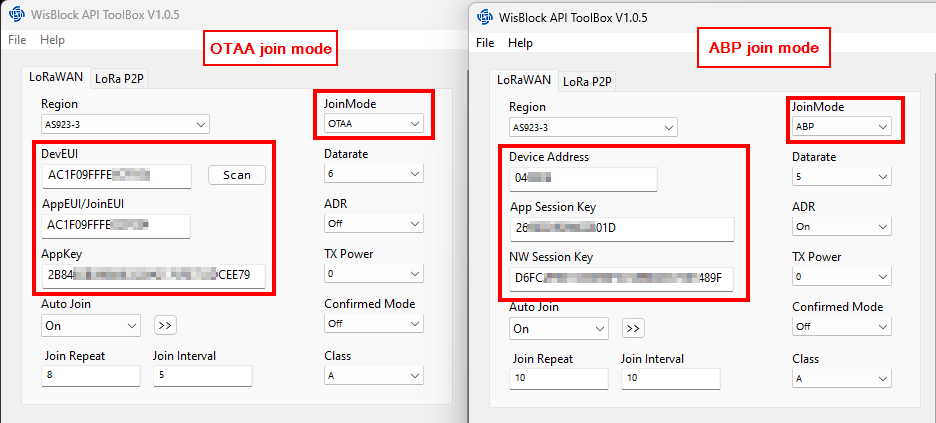

## 📝 Info
- _**Changing Datarate, ADR, TX Power, Confirmed Mode, Region and Class triggers an immediate change on the device through an AT command.**_
- _**Changing the LoRaWAN credentials are only sent to the device by pushing the Update LoRaWAN credentials button.**_
- _**Changing the join status is sent to the device only after pushing the send button next to the Auto Join selector. The join command is sent together with the Join Repeat and Join Interval values.**_

_**⚠️ After changing LoRaWAN credentials or settings, it is advised to always restart the device with a power cycle or by using the Device Restart button**_

----

## Change LoRa P2P settings

LoRa P2P settings are sent to the device immediately after changing them.

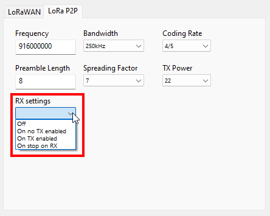

_**⚠️ LoRa P2P settings can only be changed on the device if it is NOT in receive mode.**_    
_**Disable receive mode with the RX settings selector to Off before changing any LoRa P2P settings.**_

## Additional WisBlock API Toolbox settings

Two additional settings of the WisBlock API Toolbox can be changed through the _**File**_ >> _**Settings**_ menu.    

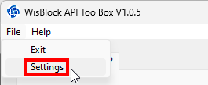

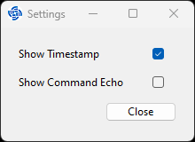

Application settings are

### Show Timestamp
Enables/disables a timestamp in the debug log screen.

### Show Command Echo
Enables/disables the display of commands sent to the device in the debug log screen.

